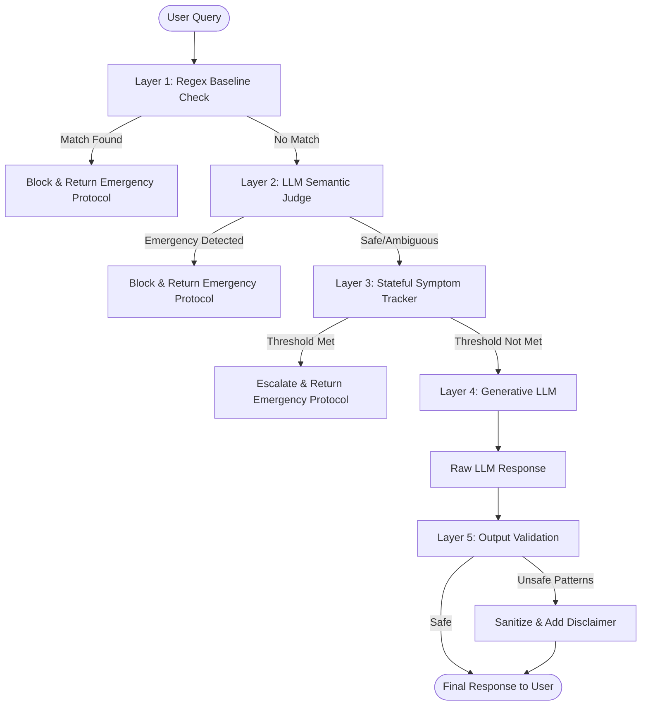

# SafeGuard: A Hybrid Rule-Based LLM Architecture

## Abstract
Large Language Models (LLMs) are increasingly deployed in user-facing applications, including healthcare and medical advisory domains. However, standard LLMs are prone to hallucinations, missing subtle emergency cues, and giving unqualified medical advice. **SafeGuard** is a hybrid architecture designed to mitigate these risks by combining ultra-fast, deterministic rule-based checks with context-aware semantic LLM evaluation. It provides a multi-layered defense mechanism that safely intercepts medical emergencies, tracks symptoms across conversation turns, and sanitizes unsafe model outputs without sacrificing the conversational utility of the underlying LLM.

---

## I. Introduction
The integration of LLMs in critical domains necessitates strict guardrails. SafeGuard introduces a tiered pipeline that processes user queries before they ever reach the primary generative LLM, and evaluates responses before they are returned to the user. By combining Regex for sub-millisecond emergency interception and a Groq-powered Llama 3.1 LLM-as-a-judge for semantic classification, SafeGuard ensures both safety and speed.

### Block Diagram and Description

**Description of Blocks:**
1. **Layer 1: Regex Baseline Check:** Performs instant, deterministic matching against known high-risk phrases (e.g., "can't breathe").
2. **Layer 2: LLM Semantic Judge:** A lightweight, fast LLM call (via Groq) that catches idioms and typos that Regex misses (e.g., "elephant sitting on my ribcage") while successfully ignoring harmless contexts (e.g., dentist visits).
3. **Layer 3: Stateful Symptom Tracker:** Extracts and accumulates symptoms across multiple conversation turns using LLM JSON extraction. It triggers an escalation if a combination of symptoms (e.g., dizziness + jaw pain) matches a dangerous cluster (like a cardiac event).
4. **Layer 4: Generative LLM:** If the query is deemed safe, the primary LLM processes the query to provide a helpful response.
5. **Layer 5: Output Validation:** A final safety pass that strips out definitive diagnoses or medication recommendations before the response reaches the user.

---

## II. Literature Review and Background Study
Traditional chatbots in healthcare rely heavily on decision trees and exact keyword matching, which are robust but highly brittle when faced with natural human language, idioms, or typos. Conversely, modern generative LLMs (like GPT-4 or Llama 3) excel at natural language understanding but struggle with strict adherence to safety boundaries, occasionally providing dangerous advice or failing to recognize life-threatening emergencies hidden in multi-turn conversations.

Recent studies on "LLM-as-a-judge" have shown promise in using smaller, faster models to oversee larger generative models. However, relying purely on LLMs for safety introduces latency. SafeGuard builds upon this by proposing a *hybrid* approach: utilizing deterministic rules for speed and baseline safety, coupled with LLM semantic evaluation for nuance and state tracking.

---

## III. Problem Definition and Relevance
**Problem:** 
When users interact with medical AI, they often describe symptoms using non-standard phrasing, idioms, or typos. Furthermore, they may reveal symptoms gradually over multiple turns. Existing systems either miss these nuances (brittle Regex) or generate unsafe medical advice (unfettered LLMs). 

**Relevance:**
Providing a foolproof safeguard system is paramount before deploying AI in health-adjacent domains. The system must:
1. Catch emergencies instantly.
2. Understand idioms and typos.
3. Remember conversation context to catch escalating symptoms.
4. Prevent the AI from acting as a doctor.

---

## IV. Design Methodology and Tools
SafeGuard is built using Python and leverages the following methodologies and tools:

* **Inference Engine:** Groq API running `llama-3.1-8b-instant`. Chosen for its ultra-low latency, allowing the safeguard pipeline to run imperceptibly fast before the main generation step.
* **Semantic Analysis:** Custom-prompted LLM classification to categorize emergencies (CARDIAC, STROKE, BREATHING, TRAUMA) while explicitly programmed to ignore harmless contexts (e.g., gym soreness, dentist visits).
* **State Management:** A custom `SessionState` class that accumulates extracted symptoms (via LLM JSON mode) over the lifetime of a conversation. It cross-references active symptoms against defined clinical clusters (e.g., Cardiac Threshold = 2 symptoms).
* **Output Sanitization:** Post-processing regex filters that intercept and rewrite definitive medical phrases (e.g., "you are diagnosed with") into safe disclaimers.

---

## V. Result Analysis and Performance Evaluation
The system was rigorously evaluated against a suite of adversarial and edge-case prompts:

1. **Semantic Catch Rate:** Successfully identified heavily misspelled queries (`my hart herts`) and complex idioms (`elephant sitting on my ribcage`) as emergencies.
2. **Contextual Awareness (The "Trap"):** Successfully allowed queries with harmless context (`my jaw hurts from the dentist`) to pass through to the generative LLM without triggering false positive emergencies.
3. **Multi-Turn Escalation:** Successfully identified a Cardiac emergency spread across three conversation turns (Turn 1: "dizzy", Turn 3: "tight jaw ache"), proving the effectiveness of the LLM-driven stateful symptom tracker.
4. **Latency:** Regex layers execute in <1ms, while the Groq-powered semantic and extraction layers add minimal overhead, maintaining real-time conversational flow.

---

## VI. Conclusion and Future Scope
**Conclusion:** 
SafeGuard successfully demonstrates that a hybrid architecture—combining deterministic rules, LLM-as-a-judge semantic routing, and stateful context tracking—can effectively mitigate the risks associated with deploying LLMs in sensitive domains. It balances the strictness required for medical safety with the flexibility needed for natural human interaction.

**Future Scope:**
* **Expansion of Clinical Clusters:** Adding more complex symptom combinations (e.g., anaphylaxis, internal bleeding).
* **Local Deployment:** Transitioning the safeguard LLM to a quantized local model (via Ollama or vLLM) to ensure absolute data privacy and zero network dependency.
* **Vector Database Integration:** Replacing hardcoded rule responses with a dynamically retrieved RAG system for highly specific, localized emergency protocols.
